# System Dependencies

Status: P07 (integrated crisis engine). The tick order lives in `core/tick.py`
(`TickPhase`, `TICK_ORDER_VERSION = "tick-order-v1"`); this document is **generated from the
code** by `core.scheduler`, so it cannot drift from the systems it describes. Both blocks below
are the verbatim output of the regeneration command at the end of this document, for the fully
wired toy economy (`build_toy_economy(with_military=True, with_migration=True)`), byte-compared
against a fresh generation before the phase report was written.

## What the numbers are

Every system class declares two `frozenset`s drawn from the resource vocabulary in
`core/tick.py`:

- `reads` — the shared resources of the tick this system consumes;
- `writes` — the shared resources it produces.

`core.scheduler.validate` (called by `SimulationKernel.__init__`) enforces three rules: system
names are non-empty and unique, systems follow the non-decreasing versioned tick order, and **no
system may read a resource in an earlier phase than the earliest writer of that resource**. A
read of a resource nobody writes is allowed: that is initial actor state, established before the
first tick. `systems_digest` condenses the registrations — `(name, phase, sorted reads, sorted
writes)` per system, in registration order — into the SHA-256 that `RunManifest` records, so a
run's manifest pins the wiring as well as the configuration, code and seed.

## Diagram

The diagram is the shared-resource graph derived from the declarations, not a hand-drawn picture:
an edge runs from a writer system to a reader system for every resource they share, parallel
edges are collapsed into one comma-joined label, and nodes are labelled `phase-token: name`.
Arrows are **not** execution order — execution order is the node's phase token. For the current
wiring `dependency_report` reports no unsatisfied edge (defended by
`tests/unit/test_scheduler.py`).

```mermaid
%% tick-order-v1 — generated by core.scheduler.as_mermaid
flowchart LR
    climate["climate_update: climate"]
    agricultural_state["agricultural_state: agricultural-state"]
    harvest["grain_production: harvest"]
    household_consumption["household_consumption: household-consumption"]
    market_clearing["market_clearing: market-clearing"]
    debt_service["credit_and_debt: debt-service"]
    tax_collection["taxation: tax-collection"]
    elite_actions["relief: elite-actions"]
    official_relief["relief: official-relief"]
    migration["migration: migration"]
    military_finance["military_finance: military-finance"]
    desertion["desertion: desertion"]
    band_recruitment["armed_recruitment: band-recruitment"]
    band_actions["armed_movement: band-actions"]
    violence["violence_consequences: violence"]
    cohort_bookkeeping["bookkeeping: cohort-bookkeeping"]
    county_bookkeeping["bookkeeping: county-bookkeeping"]
    military_bookkeeping["bookkeeping: military-bookkeeping"]
    climate -->|climate.shock| agricultural_state
    climate -->|climate.shock| migration
    agricultural_state -->|agriculture.state| harvest
    agricultural_state -->|agriculture.state| household_consumption
    agricultural_state -->|agriculture.state| cohort_bookkeeping
    harvest -->|agriculture.state, cohort.grain| harvest
    harvest -->|agriculture.state, cohort.grain| household_consumption
    harvest -->|cohort.grain, elite.grain| market_clearing
    harvest -->|cohort.grain| debt_service
    harvest -->|cohort.grain| tax_collection
    harvest -->|elite.grain| elite_actions
    harvest -->|cohort.grain| migration
    harvest -->|cohort.grain, elite.grain| band_actions
    harvest -->|agriculture.state, cohort.grain| cohort_bookkeeping
    household_consumption -->|cohort.grain| harvest
    household_consumption -->|cohort.assets, cohort.debt, cohort.grain, cohort.land, cohort.silver, elite.silver, merchant.stock| household_consumption
    household_consumption -->|cohort.grain, merchant.stock| market_clearing
    household_consumption -->|cohort.debt, cohort.grain, cohort.silver| debt_service
    household_consumption -->|cohort.assets, cohort.debt, cohort.grain, cohort.land, cohort.silver, elite.land, elite.silver| tax_collection
    household_consumption -->|cohort.debt, elite.land, elite.silver, household.distress_window| elite_actions
    household_consumption -->|household.distress_window, merchant.stock| official_relief
    household_consumption -->|cohort.assets, cohort.grain, cohort.land, cohort.silver, household.distress_window, merchant.stock| migration
    household_consumption -->|merchant.stock| military_finance
    household_consumption -->|household.distress_window| band_recruitment
    household_consumption -->|cohort.assets, cohort.grain| band_actions
    household_consumption -->|cohort.assets, cohort.debt, cohort.grain, cohort.land, cohort.silver, household.distress_window| cohort_bookkeeping
    market_clearing -->|cohort.grain| harvest
    market_clearing -->|cohort.grain, cohort.silver, elite.silver, merchant.stock| household_consumption
    market_clearing -->|cohort.grain, elite.grain, market.price, merchant.stock| market_clearing
    market_clearing -->|cohort.grain, cohort.silver, market.price| debt_service
    market_clearing -->|cohort.grain, cohort.silver, elite.silver, market.price| tax_collection
    market_clearing -->|elite.grain, elite.silver, market.price| elite_actions
    market_clearing -->|market.price, merchant.stock| official_relief
    market_clearing -->|cohort.grain, cohort.silver, market.price, merchant.stock| migration
    market_clearing -->|market.price, merchant.stock| military_finance
    market_clearing -->|cohort.grain, elite.grain| band_actions
    market_clearing -->|cohort.grain, cohort.silver| cohort_bookkeeping
    debt_service -->|cohort.grain| harvest
    debt_service -->|cohort.debt, cohort.grain, cohort.silver, elite.silver| household_consumption
    debt_service -->|cohort.grain, elite.grain| market_clearing
    debt_service -->|cohort.debt, cohort.grain, cohort.silver| debt_service
    debt_service -->|cohort.debt, cohort.grain, cohort.silver, elite.silver| tax_collection
    debt_service -->|cohort.debt, elite.grain, elite.silver| elite_actions
    debt_service -->|cohort.grain, cohort.silver| migration
    debt_service -->|cohort.grain, elite.grain| band_actions
    debt_service -->|cohort.debt, cohort.grain, cohort.silver| cohort_bookkeeping
    tax_collection -->|cohort.grain| harvest
    tax_collection -->|cohort.assets, cohort.debt, cohort.grain, cohort.land, cohort.silver, elite.silver, merchant.stock| household_consumption
    tax_collection -->|cohort.grain, merchant.stock| market_clearing
    tax_collection -->|cohort.debt, cohort.grain, cohort.silver| debt_service
    tax_collection -->|cohort.assets, cohort.debt, cohort.grain, cohort.land, cohort.silver, cohort.tax_arrears, county.silver, elite.land, elite.silver| tax_collection
    tax_collection -->|cohort.debt, elite.land, elite.silver| elite_actions
    tax_collection -->|county.silver, merchant.stock| official_relief
    tax_collection -->|cohort.assets, cohort.grain, cohort.land, cohort.silver, merchant.stock| migration
    tax_collection -->|county.silver, merchant.stock| military_finance
    tax_collection -->|cohort.assets, cohort.grain| band_actions
    tax_collection -->|cohort.assets, cohort.debt, cohort.grain, cohort.land, cohort.silver| cohort_bookkeeping
    tax_collection -->|cohort.tax_arrears, county.arrears, county.silver| county_bookkeeping
    elite_actions -->|cohort.grain| harvest
    elite_actions -->|cohort.grain| household_consumption
    elite_actions -->|cohort.grain, elite.grain| market_clearing
    elite_actions -->|cohort.grain| debt_service
    elite_actions -->|cohort.grain| tax_collection
    elite_actions -->|elite.grain| elite_actions
    elite_actions -->|cohort.grain| migration
    elite_actions -->|cohort.grain, elite.grain| band_actions
    elite_actions -->|cohort.grain| cohort_bookkeeping
    official_relief -->|cohort.grain| harvest
    official_relief -->|cohort.grain, merchant.stock| household_consumption
    official_relief -->|cohort.grain, merchant.stock| market_clearing
    official_relief -->|cohort.grain| debt_service
    official_relief -->|cohort.grain, county.silver| tax_collection
    official_relief -->|county.granary, county.silver, merchant.stock| official_relief
    official_relief -->|cohort.grain, merchant.stock| migration
    official_relief -->|county.granary, county.silver, merchant.stock| military_finance
    official_relief -->|cohort.grain, county.granary| band_actions
    official_relief -->|cohort.grain| cohort_bookkeeping
    official_relief -->|county.granary, county.silver| county_bookkeeping
    migration -->|cohort.grain| harvest
    migration -->|cohort.assets, cohort.grain, cohort.land, cohort.silver| household_consumption
    migration -->|cohort.grain| market_clearing
    migration -->|cohort.grain, cohort.silver| debt_service
    migration -->|cohort.assets, cohort.grain, cohort.land, cohort.silver| tax_collection
    migration -->|cohort.adults, cohort.assets, cohort.grain, cohort.households, cohort.land, cohort.silver| migration
    migration -->|cohort.adults| desertion
    migration -->|cohort.adults| band_recruitment
    migration -->|cohort.assets, cohort.grain| band_actions
    migration -->|cohort.adults| violence
    migration -->|cohort.adults, cohort.assets, cohort.grain, cohort.households, cohort.land, cohort.silver| cohort_bookkeeping
    military_finance -->|merchant.stock| household_consumption
    military_finance -->|merchant.stock| market_clearing
    military_finance -->|county.silver| tax_collection
    military_finance -->|county.granary, county.silver, merchant.stock| official_relief
    military_finance -->|merchant.stock| migration
    military_finance -->|county.granary, county.silver, merchant.stock, unit.pay_arrears, unit.stores| military_finance
    military_finance -->|unit.pay_arrears, unit.standing, unit.stores| desertion
    military_finance -->|county.granary| band_actions
    military_finance -->|unit.standing, unit.stores| violence
    military_finance -->|county.granary, county.silver| county_bookkeeping
    military_finance -->|unit.pay_arrears, unit.standing, unit.stores| military_bookkeeping
    desertion -->|cohort.adults| migration
    desertion -->|cohort.adults, unit.troops| desertion
    desertion -->|cohort.adults, unit.troops| band_recruitment
    desertion -->|unit.troops| band_actions
    desertion -->|cohort.adults, unit.troops| violence
    desertion -->|cohort.adults| cohort_bookkeeping
    desertion -->|unit.troops| military_bookkeeping
    band_recruitment -->|cohort.adults| migration
    band_recruitment -->|cohort.adults, unit.troops| desertion
    band_recruitment -->|cohort.adults, unit.troops| band_recruitment
    band_recruitment -->|band.standing, band.troops, unit.troops| band_actions
    band_recruitment -->|band.standing, band.troops, cohort.adults, unit.troops| violence
    band_recruitment -->|cohort.adults| cohort_bookkeeping
    band_recruitment -->|band.standing, band.troops, unit.troops| military_bookkeeping
    band_actions -->|cohort.grain| harvest
    band_actions -->|cohort.assets, cohort.grain| household_consumption
    band_actions -->|cohort.grain, elite.grain| market_clearing
    band_actions -->|cohort.grain| debt_service
    band_actions -->|cohort.assets, cohort.grain| tax_collection
    band_actions -->|elite.grain| elite_actions
    band_actions -->|county.granary| official_relief
    band_actions -->|cohort.assets, cohort.grain| migration
    band_actions -->|county.granary| military_finance
    band_actions -->|band.standing, band.stores, cohort.assets, cohort.grain, county.granary, elite.grain| band_actions
    band_actions -->|band.standing, band.stores| violence
    band_actions -->|cohort.assets, cohort.grain| cohort_bookkeeping
    band_actions -->|county.granary| county_bookkeeping
    band_actions -->|band.standing, band.stores| military_bookkeeping
    violence -->|cohort.adults| migration
    violence -->|unit.stores| military_finance
    violence -->|cohort.adults, unit.standing, unit.stores| desertion
    violence -->|cohort.adults| band_recruitment
    violence -->|band.standing, band.stores, band.troops| band_actions
    violence -->|band.standing, band.stores, band.troops, cohort.adults, unit.standing, unit.stores| violence
    violence -->|cohort.adults| cohort_bookkeeping
    violence -->|band.standing, band.stores, band.troops, unit.standing, unit.stores| military_bookkeeping
```



## Registrations

`core.scheduler.describe_table`, same command. Empty columns are `-`: those systems claim no
resource on that side, which is itself a claim worth reading (a bookkeeping phase produces no
shared state, and the climate phase consumes none).

```text
phase                 | system                | reads                                                                                                                                                             | writes                                                                                                                                                           
--------------------- | --------------------- | ----------------------------------------------------------------------------------------------------------------------------------------------------------------- | -----------------------------------------------------------------------------------------------------------------------------------------------------------------
climate_update        | climate               | -                                                                                                                                                                 | climate.shock                                                                                                                                                    
agricultural_state    | agricultural-state    | climate.shock                                                                                                                                                     | agriculture.state                                                                                                                                                
grain_production      | harvest               | agriculture.state, cohort.grain                                                                                                                                   | agriculture.state, cohort.grain, elite.grain                                                                                                                     
household_consumption | household-consumption | agriculture.state, cohort.assets, cohort.debt, cohort.grain, cohort.land, cohort.silver, elite.silver, merchant.stock                                             | cohort.assets, cohort.debt, cohort.grain, cohort.land, cohort.silver, elite.land, elite.silver, household.distress_window, merchant.stock                        
market_clearing       | market-clearing       | cohort.grain, elite.grain, market.price, merchant.stock                                                                                                           | cohort.grain, cohort.silver, elite.grain, elite.silver, market.price, merchant.stock                                                                             
credit_and_debt       | debt-service          | cohort.debt, cohort.grain, cohort.silver, market.price                                                                                                            | cohort.debt, cohort.grain, cohort.silver, elite.grain, elite.silver                                                                                              
taxation              | tax-collection        | cohort.assets, cohort.debt, cohort.grain, cohort.land, cohort.silver, cohort.tax_arrears, county.silver, elite.land, elite.silver, market.price                   | cohort.assets, cohort.debt, cohort.grain, cohort.land, cohort.silver, cohort.tax_arrears, county.arrears, county.silver, elite.land, elite.silver, merchant.stock
relief                | official-relief       | county.granary, county.silver, household.distress_window, market.price, merchant.stock                                                                            | cohort.grain, county.granary, county.silver, merchant.stock                                                                                                      
relief                | elite-actions         | cohort.debt, elite.grain, elite.land, elite.silver, household.distress_window, market.price                                                                       | cohort.grain, elite.grain                                                                                                                                        
migration             | migration             | climate.shock, cohort.adults, cohort.assets, cohort.grain, cohort.households, cohort.land, cohort.silver, household.distress_window, market.price, merchant.stock | cohort.adults, cohort.assets, cohort.grain, cohort.households, cohort.land, cohort.silver, migration.migrants                                                    
military_finance      | military-finance      | county.granary, county.silver, market.price, merchant.stock, unit.pay_arrears, unit.stores                                                                        | county.granary, county.silver, merchant.stock, unit.pay_arrears, unit.standing, unit.stores                                                                      
desertion             | desertion             | cohort.adults, unit.pay_arrears, unit.standing, unit.stores, unit.troops                                                                                          | cohort.adults, unit.troops                                                                                                                                       
armed_recruitment     | band-recruitment      | cohort.adults, household.distress_window, unit.troops                                                                                                             | band.standing, band.troops, cohort.adults, unit.troops                                                                                                           
armed_movement        | band-actions          | band.standing, band.stores, band.troops, cohort.assets, cohort.grain, county.granary, elite.grain, unit.troops                                                    | band.standing, band.stores, cohort.assets, cohort.grain, county.granary, elite.grain                                                                             
violence_consequences | violence              | band.standing, band.stores, band.troops, cohort.adults, unit.standing, unit.stores, unit.troops                                                                   | band.standing, band.stores, band.troops, cohort.adults, unit.standing, unit.stores                                                                               
bookkeeping           | military-bookkeeping  | band.standing, band.stores, band.troops, unit.pay_arrears, unit.standing, unit.stores, unit.troops                                                                | -                                                                                                                                                                
bookkeeping           | cohort-bookkeeping    | agriculture.state, cohort.adults, cohort.assets, cohort.debt, cohort.grain, cohort.households, cohort.land, cohort.silver, household.distress_window              | -                                                                                                                                                                
bookkeeping           | county-bookkeeping    | cohort.tax_arrears, county.arrears, county.granary, county.silver                                                                                                 | -                                                                                                                                                                
```

## The institutional decision layer (P11)

P11 adds one more system at the slot the tick order reserved for it from the beginning,
``institutional_decisions`` (phase 15, between military finance and bookkeeping):
``policies.institutional.InstitutionalDecisionSystem``. It is **not** part of the default wiring, so
the tables above are unchanged: a run that wants runtime decisions builds the layer and merges it in
by phase (`experiments/institutional_smoke.py`). It reads the fiscal, armed, distress and migration
state of the month that just ended and writes no resource of its own tick — what it changes are
*policy inputs* (the extraction policy, the relief share, the market's disruption regime), which the
systems after it consult next month. The scheduler validates it like any other system.

## Regenerating

```bash
uv run python -c "
from late_ming_lab.core import scheduler
from late_ming_lab.experiments.assembly import build_toy_economy
systems = build_toy_economy(with_military=True, with_migration=True).systems
print(scheduler.as_mermaid(systems))
print()
print(scheduler.describe_table(systems))
"
```

## What the rule does and does not claim

The scheduler enforces a **phase-level dependency claim**: for every resource a system declares
as read, the earliest phase that declares it as written must run at or before the reader's phase,
and a violation raises `SchedulerError` naming the resource, the reader and both phases. That is
what makes the tick order a contract instead of a convention: registering the market before
household consumption, or a relief phase that reads tax receipts the same phase has not yet
produced, fails at kernel construction rather than silently reading last month's numbers. It
does **not** claim to be a dataflow proof. A declaration names the resources whose ordering the
system actually depends on, not every attribute it touches: the household consumption phase
trades at the posted price carried over from the *previous* tick and reads adult and household
counts that only change later in the tick, the harvest reads a land endowment that only shrinks
later, and military finance pays a garrison whose troop count likewise changes after it runs —
those carried-over reads are deliberately not declared, because they are inputs of the month, not
products of it. Nor does the rule prove that a declared reader consumes the writer's value rather
than an earlier one, and it says nothing about conservation: the per-system journals and the
invariant checks are what reconcile quantities, and `dependency_report` exposes every
`(resource, writer, reader)` triple with its `satisfied` verdict so a reader can audit the claims
instead of trusting the picture.
